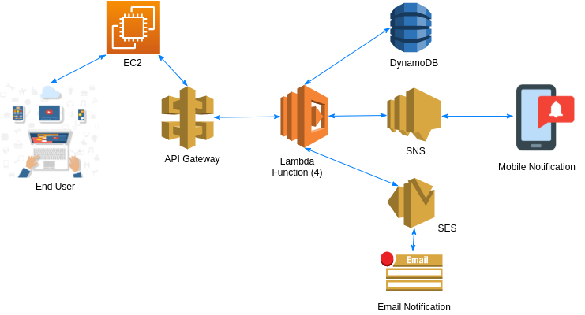

```

This project is under development. Here you can find the initial research done on project.
Expected milestone : December End

```
# Plasma-Donor-Application

# **INTRODUCTION**

**Background Study**
<p align="justify">
Public health concern is increasing with the recent rise in the number of COVID-19 cases in the world. WHO has encouraged people to implement social distancing so as to reduce interactions between people which could reduce the possibilities of new infection; however, it has affected the overall physical, mental, social and spiritual health of the people. Globally, as of 20th November 2020, there have been 56,261,952 confirmed cases of COVID-19, including 1,349,506 deaths, reported to WHO[1]. Based on the past pandemic&#39;s experiences, the SARS-CoV-2 (COVID-19) can return with even more lethal force, hence it could be assumed that the second wave of the pandemic could be more lethal. The vast majority of countries of Europe are declaring more cases each day now than they were during the first wave earlier this year.
</p>
<p align="justify">
Most of the promising vaccines for COVID-19 are in third phase trials and suffer from the authorisation procedure, till then illness and fatalities continue. The avenues of possible treatment for COVID-19 is namely Plasma therapy and Antivirals. Convalescent Plasma Therapy (CPT) [2] has been a possible cure which is the administration of blood plasma of patients who have recovered from infection. The science behind plasma therapy for COVID-19 is that a person who is already infected with COVID-19 and recovers back, naturally generates antibodies against the virus in their blood, which makes their blood equivalent to drugs against the same infection i.e antibodies are produced and present only in plasma.
</p>

**Project Motivation**
<p align="justify">
During this pandemic, the requirement of plasma has become high because of the daily increase in the number of cases of people all over the world. The problem arises with the number of donor counts which is very low. As once the people even get cured from this virus, there is social, mental pressure and they are less likely to donate the plasma. So saving the information after the patient gets cured and notifying only the donors to help whenever necessary which increases the helping hand and can save the life of some person. So in this regard, an application is built which takes the details of the person(donor), stores them and whenever a request is made for the same plasma type notifies the respective donor.
</p>

**Overview of application**
<p align="justify">
The central concept of the application is to allow the users to either register as plasma donors virtually using the Internet and allow the needy to request the plasma of their desired blood type from the application. The information pertaining to the plasma and users are stored on an NoSQL database at the server side. The Server processes the customers&#39; requests submitted by them. The application was designed into two modules first for the donors who wish to donate the plasma. Second is for the receivers who need the plasma. They both are end users of this application, where the application is hosted on the web and the administrator maintains the database and looks after application health. The application also views the details of the number of donors for each blood type brought forward from the database and the database of all the donors are updated after addition of new users which is updated on users end also. Data entry into the application can be done through various screens. Authorized personnel can feed the relevant data into the system directly using the console, and also through the API created for the database. Finally donors of the relevant blood type are informed once the application receives a request for the blood type.

**Objectives**
<p align="justify">
The objective of the project is to make a web application for plasma donors with AWS. AWS Serverless computing enabled us to build modern applications with increased agility and lower total cost of ownership. Building a Serverless application means developers can focus on the application instead of managing and operating servers on runtime. In order to build such an application complete web support needs to be provided. A complete and efficient web application which can provide the better experience is the basic objective of the project. The main purpose behind the proposed system is to provide a comprehensive computerized system, which can capture, collate and analyse the data and evaluate the impact of the program.

- The proposed system will be less time consuming and is more efficient.
- Analysis will be very easy in the proposed system as it is automated.
- The proposed system is very secure with no chances of loss of data as it is dependent on the administrator only.
- To learn about the Amazon Web Services.
- To learn about data handling on AWS.
- To create a web site focusing on one of the many problems that arises within plasma donation.
- To help people who require plasma when they are affected with the virus.

# **METHODOLOGY**
<p align="justify">
Plasma Donor Application is a web based application hosted on the server where a user(Donor) who wants to donate plasma can register on the application with the basic details such as name, address, phone number, email address, age and blood type. And a user who wants to receive plasma can make their request through the application. So whenever a request is made a notification is sent via email or sms message to the user(donor).

Initially, data of people who want to donate plasma needs to be collected.

**Data Collection:**
<p align="justify">
Method of data collection:

Primary source:

The primary source of data can be a user registering themselves as a donor with valid identification.

Secondary Source:

The secondary source of data can be governmental data and the data provided by the hospital or concerned department.

After the data is collected it needs to be stored on the database for its use in the application.

**Create a database:**
<p align="justify">
NoSQL database service provided by AWS is used as data of users can vary as some users might want to help but without disclosing their address. So a json database is created to store the information of the donor.

**Create compute service** :
<p align="justify">
Whenever a user sends their data or makes a request of data these need to be computed and handled properly. So cloud functions are required to handle and scale these data.

**Application Program Interface** :
<p align="justify">
An interface is also required to access these functions from the external medium, so API for each function securely passes the data.

**Graphical User Interface:**
<p align="justify">
A graphical interface helps our end users to use our application conveniently. In GUI there are different options for users to interact with.

# **DESIGN OF THE SYSTEM**



Figure 1: Reference Architecture Diagram
<p align="justify">
The figure 1 represents the reference architecture diagram for Plasma Donor Application. This shows the flow of data from one service to another service of AWS.
<p align="justify">
End User: This is our user who accesses our web application. It can be either Donor or Receiver. Donors will be able to register and the Receiver can make a request using the application.
<p align="justify">
EC2: Amazon Elastic Compute Cloud (Amazon EC2) provides scalable computing capacity in the AWS cloud. Using Amazon EC2 eliminates the need to invest in hardware up front, so we can develop and deploy applications faster. EC2 is created to host our application on the AWS platform so that application is available throughout the internet.
<p align="justify">
API Gateway: Amazon API Gateway is an Amazon Web Services (AWS) service offering that allows a developer to connect non-AWS applications to AWS back-end resources, such as servers or code. API Gateway helps to manage, create, publish, maintain, monitor and secure our API.
<p align="justify">
Lambda Function: Lambda, a serverless compute platform that has changed the way that developers around the world build applications. It is a computing service that runs code in response to events and automatically manages the computing resources required by that code. It helps to run our code without a server and interact with other services of AWS.
<p align="justify">
DynamoDB: Amazon DynamoDB is a fast and flexible NoSQL database service for all applications that need consistent, single-digit millisecond latency at any scale. It is a fully managed cloud database and supports both document and key-value store models. It is used to store all the data of our application. Like donor information receiver requests and other data as well.
<p align="justify">
SNS: Amazon SNS enables us to modernize your applications and decouple them into smaller, independent components that are easier to develop, deploy and maintain. SNS is used to send notifications to the mobile phone of the end user.
<p align="justify">
SES: Amazon Simple Email Service (SES) is a cost-effective, flexible, and scalable email service that enables us to send mail from within any application. It is used to send email to the registered email address of the user.

# **Features of the Software**

The system after careful analysis has been identified to be presented with the following modules and roles. The modules involved are:

- Administrator
- Users
- Security and Authentication

Administrator
<p align="justify">
The administrator is the super user of this application. Only the admin has access to all the information about all the users and about all datas. The admin is the AWS users through which this application is being hosted and the database is being created.

Customers
<p align="justify">
Registration: A new user will have to register in the system by providing essential details.

Login: A user must login with his username and password to the system after registration.

Make Request: Users can make requests to the desired blood types.

View Information: Users can view the number of donations for each blood type but not user information which enhances security of application.

Security and Authentication

A user needs to be authenticated to use the application, this enhances security of the application.

#


# **SYSTEM REQUIREMENTS SPECIFICATION**

To develop this application recommended hardware and software were used. Higher than

recommended specifications will help the application to run smoothly.

**Software requirements: -**

Browser: Google Chrome (Recommended), Firefox

Cloud Platform: Amazon Web Services: (DynamoDB, Lambda Function, Identity and Access Management, API Gateway, Amazon EC2, Cloud Watch, Amazon SNS, Amazon SQS), fast2sms

Language: Python, Javascript

Editor: AWS Console, Visual Studio Code / Sublime Text / Notepad / Notepad++

Hardware requirements: -

**Computer Specification:**

Operating System: Windows XP/7 or Linux

Processor: 2GHz or above.

RAM (SD/DDR): 4 GB or above

Hard Disk: 30 GB

**EC2 Server:**

Region: N.Virginia, Ohio or Mumbai

Machine Image: Ubuntu Server 14.04 (Free Tier)

Instance Type: t2.micro

Security group: SSH.HTTP

Storage: 8GB

# **FURTHER WORK DETAILS**
<p align="justify">
The project &quot;Plasma Donor Application&quot; is in the process of the development. Initial planning of the project has been finished, the use of the technology and services has been decided. Further we will be working on the implementation and integration of the project. We are planning to use Github to organize our project so that we can set the milestone of the project. In order to complete it effectively we are setting the deliverables and timeframes for each of the project activities. It is very important to review the progress of the application and update about the feedback as well. We will be organizing the meet virtually to keep us updated about each other&#39;s work. Most importantly we will be following a pair programming approach so that it will be easy even if some members are unavailable with the view of the current scenario. This project will have satisfaction in having designed an application which can help lots of people and lives of the needy.There is a scope for further development in our project to a great extent. A number of features can be added to this system in future.

# **CONCLUSION**
<p align="justify">
Few treatment options available to manage coronavirus disease Covid-19, the disease presents a unique set of challenges for healthcare providers globally. In addition to using non-drug interventions, health systems have devised strategies to manage Covid-19 using repurposed drugs and revisiting older strategies, such as convalescent plasma. In the past, convalescent plasma was used as a passive immunisation strategy to treat viral diseases, raising expectations that potentially it could be used to treat severe acute respiratory syndrome coronavirus 2 (SARS-CoV-2), the virus responsible for Covid-19 and a disease with no proven, effective interventions. Convalescent plasma is a source of antiviral neutralising antibodies.
<p align="justify">
So the project entitled Plasma Donor Application is started, the system has been developed with much care and free of errors and at the same time it is efficient and less time consuming. The purpose of this project was to develop a web application for the interaction of the donor and receiver of the plasma.
<p align="justify">
This project helped us in gaining valuable information and practical knowledge on several topics like Amazon Web Services, Database management and also designing the web application. The entire system is secured. Also the project helped us understand about the development phases of a project and software development life cycle. We will be testing the different features of a project in different conditions.

```
Disclaimer

All copyrights to the images and icons or any form of text used  in this project belong to their respective owners.
They are used for educational purpose only. 
```